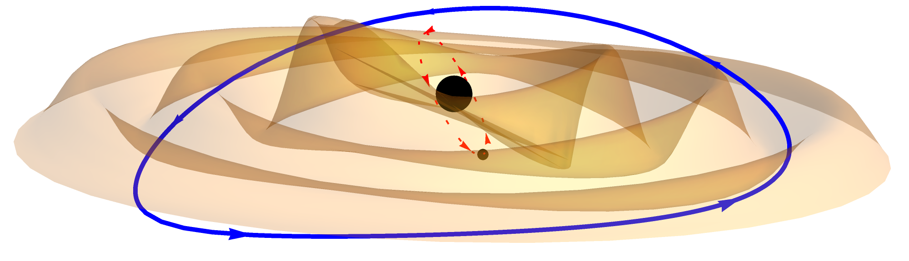

# Modified Teukolsky Equation for EMRIs in Matter Environments



Computational supplementary material for the paper **"Towards relativistic inspirals into black holes surrounded by matter"** by Lukáš Polcar and Vojtěch Witzany (2025), ArXiv: 2507.XXXXX.

## Repository Contents

### Mathematica Notebooks

#### `ModifiedTeukolsky.nb`
Derivation of the modified Teukolsky equation with explicit forms of individual terms.
*Corresponds to Sections II E, II F, and Appendix B*

#### `Sourceincoordinates.nb`
Evaluation of the modified effective source localized on the matter shell in Schwarzschild coordinates. Solves the (1,1) equations for the ring dynamics.
*Corresponds to Section IV*

#### `SourceinNPGHPformalism.nb`
Two-part notebook:
- **Part 1** (A. Spiers): Newman-Penrose and Geroch-Held-Penrose formalism setup, perturbed NP scalar computations
- **Part 2** (L. Polcar): Effective source construction using reconstructed (0,1) metric via Hertz potential, decomposition into spin-weighted spherical harmonics

*Corresponds to Section IV*

#### `Thebackgroundspacetime.nb`
Background spacetime derivation using Israel junction conditions to match linearized Kerr solutions. Computes (1,0) Newman-Penrose quantities and stress-energy tensor on the matter shell.
*Corresponds to Section III and Appendix C*

### Datasets

*[Dataset descriptions to be added]*

## Citation

Please lookup the citation key on InspireHEP for bibliographic updates

```bibtex
@article{Polcar:2022XXX,
    author = "Polcar, Luk{\'a}{\v{s}} and and Witzany, Vojt{\v{e}}ch",
    title = "{Towards relativistic inspirals into black holes surrounded by matter}",
    eprint = "2507.XXXXX",
    archivePrefix = "arXiv",
    primaryClass = "gr-qc",
    journal = "Submitted to Phys. Rev. D",
    year = "2025"
}

```

For NP/GHP formalism components, also cite:
- A. Spiers, A. Pound, and J. Moxon, Phys. Rev. D **108**, 064002 (2023)

## Authors

- Lukáš Polcar
- Vojtěch Witzany  